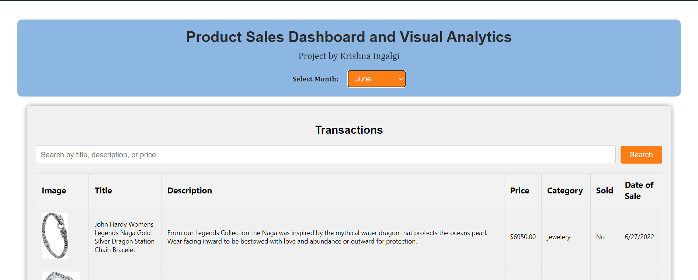
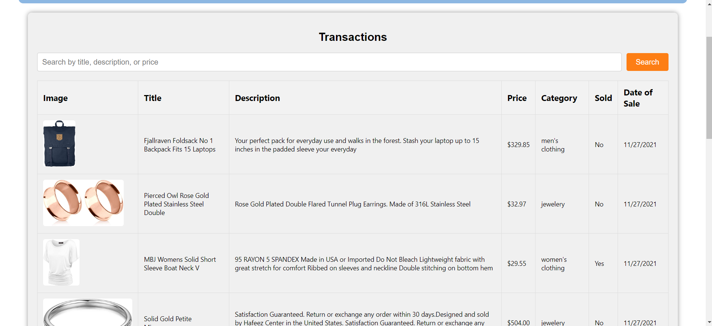
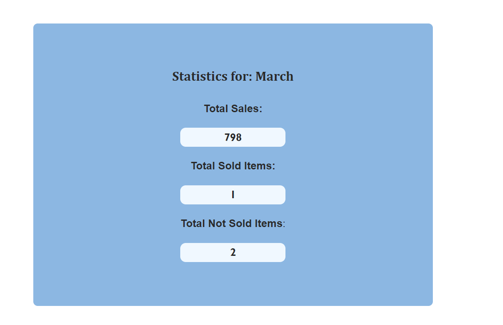
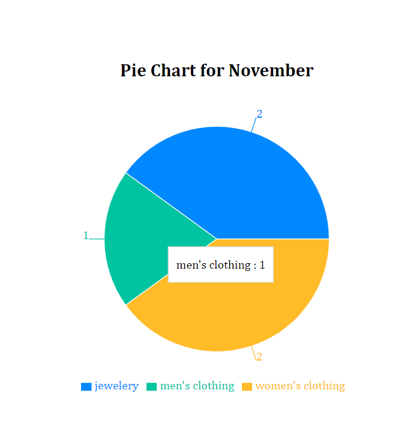
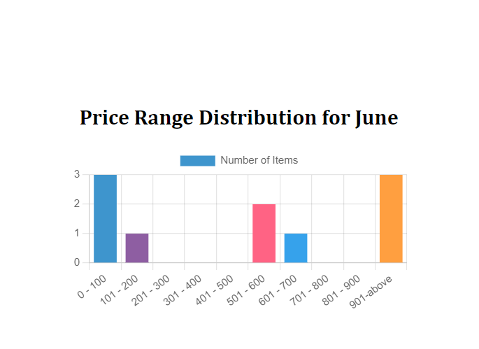

# Product Sales Dashboard and Visual Analytics

Product Sales Dashboard and Visual Analytics is a web application that displays transaction data in various visual formats such as tables, charts, and statistics. It provides insights into monthly sales, transaction details, and visual representations using React.js and Node.js.

**Author:** Krishna Ingalgi

## Features

- **Transactions Table**: View detailed transaction data including title, description, and price.
- **Statistics**: Display statistics for total sales amount, sold items, and unsold items for a selected month.
- **Pie Chart**: Visualize data distribution using a pie chart based on price ranges.
- **Bar Chart**: Display a bar chart representing the number of products in each price range.

## Technologies Used

- **Frontend**: React.js, Axios, Recharts, React Chart.js 2
- **Backend**: Node.js, Express, MongoDB, Mongoose
- **Styling**: CSS (with Bootstrap for basic styling)
- **Others**: dotenv (for environment variables), nodemon (for auto-restarting the server), cors (for enabling CORS in Express)

## Installation

To run this project locally, clone the repository and follow these steps:

1. **Backend Setup**:
   - Navigate to the `backend` directory.
   - Install dependencies: `npm install`.
   - Start the server: `npm start`.

2. **Frontend Setup**:
   - Navigate to the `frontend` directory.
   - Install dependencies: `npm install`.
   - Start the development server: `npm start`.

3. **Database Setup**:
   - Ensure MongoDB is installed and running locally or configure a remote database URL in `backend/config/db.js`.

4. **Environment Variables**:
   - Create a `.env` file in the `backend` directory and configure environment variables like `PORT`, `DB_URL`, etc.

## Usage

- Select a month using the dropdown to view transaction details for that month.
- Use the search bar to filter transactions by title, description, or price.
- Navigate through pages using the pagination buttons to view more transactions. By default set value is '5' (adjust as needed)

## Screenshots

## Contributing

Contributions are welcome! Fork the repository and submit a pull request with your improvements.

## Portfolio

